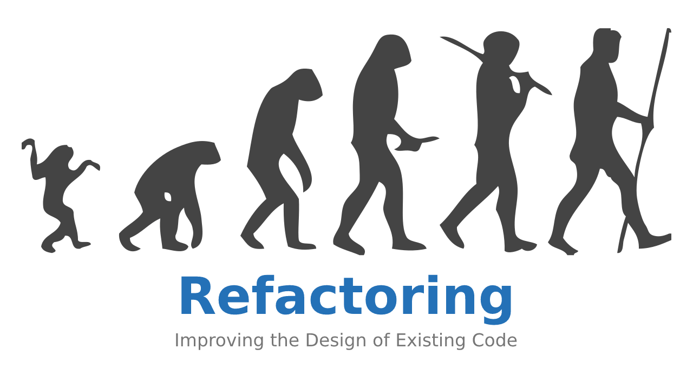

<h1 align="center">LegacyRevived</h1>
<h6 align="center">Refactor an Old Project</h6>

  <a href="#dart-goal">Goal</a> &#xa0; | &#xa0; 
  <a href="#rocket-technologies">Technologies</a> &#xa0; | &#xa0;
  <a href="#memo-Sources">Sources</a> 

 

## :dart: Goal ##

LegacyRevived is a project dedicated to revitalizing and refactoring an old codebase that dates back to about 6 years ago. Through this repository, I aim to showcase the step-by-step process of modernizing the code and improving its quality, readability, and maintainability.

The primary goal of this project is to demonstrate the power of refactoring and highlight the transformation that can be achieved by applying software engineering best practices. By sharing my refactoring journey, I hope to inspire and educate fellow developers on the importance of continuous improvement and the impact it can have on legacy projects.

## Day 1 | The Power of Autoloaders ##

In the ongoing LegacyRevived project, the first significant step taken was the adoption of the PSR-4 autoloading approach. By leveraging the power of PSR-4, all unnecessary include and require statements were eliminated, simplifying the codebase and enhancing overall maintainability. With the PSR-4 autoloader in place, classes are now automatically loaded on-demand, following the standardized namespace-to-directory mapping. This crucial update marks a significant milestone in revitalizing the legacy project and sets the foundation for future enhancements and refactoring endeavors...
- [Read More...](https://www.php.net/)

## :rocket: Technologies ##

The following tools were used in this project:

- [PHP](https://www.php.net/)
- [JS](https://developer.mozilla.org/en-US/docs/Web/JavaScript)
- [CSS](https://www.w3schools.com/css/)

## :memo: Sources ##
- Author : Farid Haghgooyan
- [Website](https://mrhaghgooyan.com/)

<a href="#top">Back to top</a>
